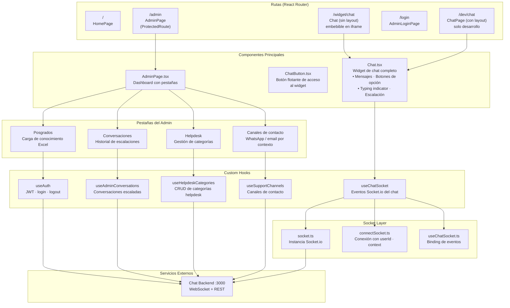
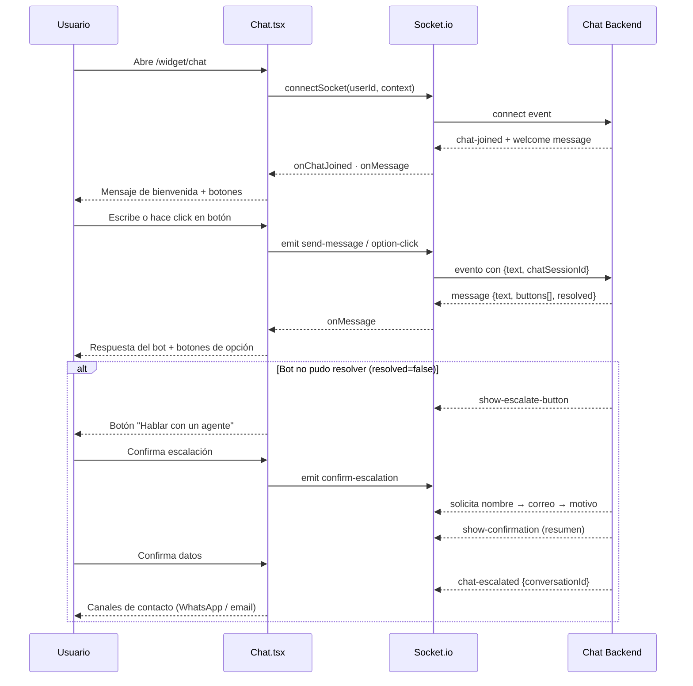

# Chat Frontend — USTA Posgrados

Aplicación React que sirve como widget de chat embebible y panel de administración para el Asistente de Posgrados de la Universidad Santo Tomás Seccional Tunja. Se comunica en tiempo real con el Chat Backend vía WebSocket (Socket.io).

## Stack

- **React 19** + TypeScript
- **Vite** — bundler + dev server
- **Tailwind CSS** — estilos utilitarios
- **Socket.io Client** — comunicación en tiempo real
- **React Router** — navegación SPA
- **react-markdown** — renderizado de respuestas del bot en Markdown
- **lucide-react** — iconografía

---

## Arquitectura



---

## Flujo del widget de chat



---

## Estructura del proyecto

```
src/
├── components/
│   ├── Chat.tsx              # Widget de chat principal (mensajes, botones, typing, escalación)
│   └── ChatButton.tsx        # Botón flotante para abrir el chat
│
├── pages/
│   ├── Home/
│   │   └── HomePage.tsx      # Landing page
│   ├── Chat/
│   │   └── ChatPage.tsx      # Página de chat para desarrollo (con layout)
│   └── Admin/
│       ├── AdminLoginPage.tsx # Login con JWT
│       ├── AdminPage.tsx      # Dashboard principal (4 pestañas)
│       ├── HelpdeskPage.tsx   # CRUD de categorías de helpdesk
│       └── PosgradosPage.tsx  # Carga de archivos Excel de conocimiento
│
├── hooks/
│   ├── useAuth.ts                  # Estado de autenticación + JWT
│   ├── useAdminConversations.ts    # Conversaciones escaladas
│   ├── useHelpdeskResponses.ts     # Categorías helpdesk (CRUD)
│   └── useSupportChannels.ts       # Canales de contacto (WhatsApp / email)
│
├── socket/
│   ├── socket.ts             # Instancia global de Socket.io
│   ├── connectSocket.ts      # Helper de conexión con parámetros de sesión
│   └── useChatSocket.ts      # Hook con todos los event listeners del chat
│
├── router/
│   ├── index.tsx             # Definición de rutas
│   └── ProtectedRoute.tsx    # Guard de autenticación JWT
│
├── layouts/
│   └── RootLayout.tsx        # Layout con navegación para rutas internas
│
└── main.tsx
```

---

## Rutas

| Ruta | Componente | Acceso | Descripción |
|---|---|---|---|
| `/` | `HomePage` | Público | Landing page |
| `/widget/chat` | `Chat` | Público | Widget embebible (sin layout, para iframe) |
| `/dev/chat` | `ChatPage` | Público | Chat con layout — solo para desarrollo |
| `/login` | `AdminLoginPage` | Público | Login de administradores |
| `/admin` | `AdminPage` | JWT requerido | Dashboard de administración |

### Pestañas del Admin

| Pestaña | Funcionalidad |
|---|---|
| **Conversaciones** | Listado de conversaciones escaladas, historial de mensajes, búsqueda |
| **Canales de contacto** | Configurar WhatsApp y email por contexto (`posgrados` / `mesa_ayuda`) |
| **Helpdesk** | Crear, editar y eliminar categorías de intenciones del helpdesk |
| **Posgrados** | Subir archivos `.xlsx` para actualizar el conocimiento del RAG |

---

## Eventos WebSocket relevantes

| Evento | Dirección | Descripción |
|---|---|---|
| `send-message` | → Server | Enviar mensaje de texto |
| `option-click` | → Server | Click en botón de opción rápida |
| `chat-joined` | ← Server | Confirmación de sesión + historial |
| `message` | ← Server | Nuevo mensaje del bot con `buttons[]` opcionales |
| `show-escalate-button` | ← Server | Mostrar opción de escalación |
| `show-confirmation` | ← Server | Mostrar resumen antes de escalar |
| `chat-escalated` | ← Server | Escalación confirmada y persistida |
| `session-expired` | ← Server | Sesión expirada por inactividad |

---

## Instalación

```bash
npm install
```

### Variables de entorno

Crea un archivo `.env` en la raíz:

```env
VITE_SERVER_URL=http://localhost:3000
```

### Desarrollo

```bash
npm run dev
```

La app estará disponible en `http://localhost:5173`.

### Build de producción

```bash
npm run build
npm run preview
```

---

## Embeber el widget

La ruta `/widget/chat` está diseñada para ser embebida en cualquier página institucional mediante un `iframe`:

```html
<iframe
  src="https://<dominio>/widget/chat"
  style="position: fixed; bottom: 24px; right: 24px;
         width: 420px; height: 640px; border: none; z-index: 9999;"
  allow="microphone"
></iframe>
```

El widget acepta los parámetros de contexto vía query string o configuración interna (`posgrados` / `mesa_ayuda`).
